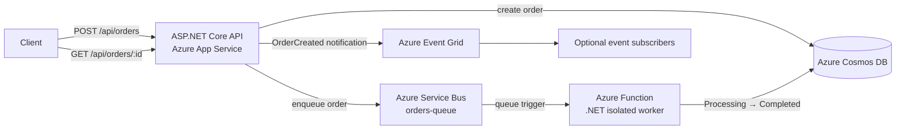

# OrderSystem


OrderSystem is a cloud-based order-processing system built with ASP.NET Core 8 and Azure. It models the part of an order workflow that happens after an HTTP request: persist the order, publish work for asynchronous processing, update its status, and expose the result through an API.

> **Demo status:** the original Azure deployment has been archived. The source, architecture, and CI remain available for review; the deployment workflow is manual and requires an active Azure subscription.

## Overview

The project demonstrates:

- a .NET 8 REST API with Swagger/OpenAPI;
- Cosmos DB persistence for orders;
- Azure Service Bus for background work;
- an isolated-process Azure Function that consumes the queue and updates order status;
- Event Grid publication for other event subscribers;
- a GitHub Actions CI path that restores, builds, and tests without Azure credentials.

This is an API and background-processing project, not a full-stack UI application. The asynchronous workflow is the main feature.

## Architecture and data flow



The request path and background path are intentionally separate:

1. `POST /api/orders` validates the request and creates an order with `Created` status.
2. The API writes the order to Cosmos DB, sends the order to the `orders-queue`, and publishes an `OrderCreated` Event Grid event.
3. `OrderSystem.Processor` is triggered by Service Bus, changes the order to `Processing`, simulates work, then writes `Completed` back to Cosmos DB.
4. `GET /api/orders/{id}` reads the current state from Cosmos DB. Event Grid is a notification channel; it does not trigger the Function in this repository.

| Component | Responsibility |
| --- | --- |
| ASP.NET Core API | HTTP contract, validation, persistence, and event publication |
| Cosmos DB | Stores orders in the `OrderProcessingDb` database and `Orders` container |
| Service Bus | Decouples the request from background processing through `orders-queue` |
| Azure Function | Consumes queue messages and updates order status |
| Event Grid | Publishes `OrderCreated` notifications for independent subscribers |

## Repository structure

```text
OrderSystem.sln
├── OrderSystem.Api/                 ASP.NET Core API
├── OrderSystem.Common/              Shared order and message contracts
├── OrderSystem.Processor/           Azure Functions isolated worker
├── tests/OrderSystem.Common.Tests/  Contract and domain tests
└── .github/workflows/
    ├── ci.yml                       Restore, build, and test on PRs and main
    └── main_app-orderprocessing-api.yml  Manual Azure deployment
```

## Run locally

### Prerequisites

- .NET 8 SDK
- access to Azure Cosmos DB, Service Bus, and Event Grid resources
- Azure Functions Core Tools only if you want to run the processor locally

The API can start without contacting Azure, and `/health` is available as a process check. Order operations are not an offline demo: `POST` and `GET` require the three configured Azure services. No emulator or in-memory substitute is included, so do not expect `dotnet run` alone to create a working order.

### Restore, build, and test

From the repository root:

```bash
dotnet restore OrderSystem.sln
dotnet restore OrderSystem.Processor/OrderSystem.Processor.csproj
dotnet build OrderSystem.sln --configuration Release --no-restore
dotnet test OrderSystem.sln --configuration Release --no-build
```

The second restore is intentional: the Azure Functions SDK generates its binding metadata from the Function project itself.

### Configure the API

Copy `OrderSystem.Api/appsettings.Development.example.json` to `OrderSystem.Api/appsettings.Development.json` and replace the placeholders with credentials for:

| Setting | Azure resource |
| --- | --- |
| `ServiceBus:ConnectionString` | Service Bus namespace |
| `EventGrid:Endpoint` / `EventGrid:Key` | Event Grid topic |
| `Cosmos:ConnectionString` | Cosmos DB account |

The development file is ignored by Git. Never commit real connection strings or access keys.

Start the API with the documented local ports:

```bash
dotnet run --project OrderSystem.Api --launch-profile OrderSystem.Api
```

Then open [Swagger](http://localhost:5000/swagger) or check [health](http://localhost:5000/health). Local development uses HTTP so it does not require a machine-specific HTTPS developer certificate; deployed environments still use HTTPS redirection.

### Configure the Function

Copy `OrderSystem.Processor/local.settings.json.example` to `OrderSystem.Processor/local.settings.json`. The Function needs `ServiceBus__ConnectionString` and `Cosmos__ConnectionString`; `AzureWebJobsStorage` is used by the Functions host. Run it with Azure Functions Core Tools from the processor directory:

```bash
func start
```

The queue name and Cosmos database/container are defined in the source and must match the API configuration.

## API example

With Azure configuration in place, create an order:

```bash
curl -X POST "http://localhost:5000/api/orders" \
  -H "Content-Type: application/json" \
  -d '{"customerName":"Ada Lovelace","product":"Analytical Engine","quantity":1,"price":99.99}'
```

The API returns `201 Created` with a location for the new resource:

```json
{
  "id": "<order-id>",
  "status": "Created",
  "message": "Order created successfully."
}
```

Read the current order state with:

```bash
curl "http://localhost:5000/api/orders/<order-id>"
```

The processor will move the order from `Created` to `Processing` and then `Completed` after the queue message is handled.

## Testing and CI

The default [CI workflow](.github/workflows/ci.yml) runs on pull requests and pushes to `main`. It has read-only repository permissions and does not need Azure credentials or provisioned cloud services. The tests currently cover the shared order total calculation and request validation rules.

Azure deployment is deliberately separate in [the deployment workflow](.github/workflows/main_app-orderprocessing-api.yml). It runs only through `workflow_dispatch` and requires the configured Azure federated-identity secrets. A failed deployment therefore does not make the build/test signal red or imply that the source does not compile.

## Deployment status

The historical App Service deployment is archived and is not presented as a live demo. To deploy a new instance, restore the required Azure resources and repository secrets, then run the deployment workflow manually. The workflow uses OIDC through `azure/login`; it does not store credentials in the repository.

## Lessons learned

- Separate source verification from environment-dependent deployment so CI remains useful when cloud resources are unavailable.
- Treat connection strings and access keys as runtime configuration, never as source files.
- Use Service Bus to move slow or retryable work out of the HTTP request path.
- Document the actual trigger for each service: the Function consumes Service Bus, while Event Grid remains an independent notification channel.

## Project note

This repository is a portfolio project by Mario Martins.
